# Rockchip快速上手OpenHarmony L2

发布版本：V0.0.3

日期：2021-09-03

文件密级：□绝密   □秘密   □内部资料   ■公开

**免责声明**

本文档按“现状”提供，本人不对本文档的任何陈述、信息和内容的准确性、可靠性、完整性、适销性、特定目的性和非侵权性提供任何明示或暗示的声明或保证。本文档仅作为使用指导的参考。本文档将可能在未经任何通知的情况下，不定期进行更新或修改。

**商标声明**

本文档可能提及的其他所有注册商标或商标，由其各自拥有者所有。

**版权所有© `Caesar Wang <sasukewxt@163.com>`**

---

**前言**

**概述**

文档主要介绍OpenHarmony L2如何快速移植 RK3288/RK3326/RK3399/RK3566 等芯片， 让开发者能够进一步开发和适配Rockchip平台。

**各芯片系统支持状态**

| **芯片名称**  | **OpenHarmony L0** | **OpenHarmony L1** | **OpenHarmony L2** |
| :-----------: | :----------------: | :----------------: | :----------------: |
|    RK3288     |         N          |         N          |         Y          |
|    RK3326     |         N          |         N          |         Y          |
|    RK3399     |         N          |         N          |         Y          |
| RK3566/RK3568 |         N          |         N          |         Y          |

 **修订记录**

|  **日期**  | **版本** |  **作者**   | **修改说明** |
| :--------: | :------: | :---------: | :----------: |
| 2021-08-10 |  V0.0.1  | Caesar Wang |  初始版本。  |
| 2021-08-15  |  V0.0.2  | Caesar Wang |  合并芯片。  |
| 2021-09-03  |  V0.0.3  | Caesar Wang |  修复一些显示问题。  |

---

**目录**

[TOC]

---

## 源码获取说明

### 获取OpenHarmony L2官网源码

参考 [OpenHarmony官网](https://gitee.com/openharmony/docs/blob/master/zh-cn/device-dev/get-code/sourcecode-acquire.md)获取最新master分支代码


```shell
repo init -u https://gitee.com/openharmony/manifest.git -b master --no-repo-verify
repo sync -c
repo forall -c 'git lfs pull'
```
### 获取Rockchip官方Linux SDK源码

Rockchip Linux SDK 下载命令如下：

| **芯片**   | **版本** | **下载命令** |
| -----------| :------------- | :------------- |
| RK3566、RK3568 | Linux4.19 | repo init --repo-url ssh://git@www.rockchip.com.cn/repo/rk/tools/repo -u \ <br/>ssh://git@www.rockchip.com.cn/linux/rockchip/platform/manifests -b linux -m \ <br/>rk356x_linux_release.xml |
| RK3399 | Linux4.19 |  repo init --repo-url ssh://git@www.rockchip.com.cn/repo/rk/tools/repo -u \ <br/>ssh://git@www.rockchip.com.cn/linux/rockchip/platform/manifests -b linux -m \ <br/>rk3399_linux4.19_release.xml |
| RK3326 | Linux4.19 |  repo init --repo-url ssh://git@www.rockchip.com.cn/repo/rk/tools/repo -u \ <br/>ssh://git@www.rockchip.com.cn/linux/rockchip/platform/manifests -b linux -m \ <br/>rk3326_linux4.19_release.xml |
| RK3288| Linux4.19 |  repo init --repo-url ssh://git@www.rockchip.com.cn/repo/rk/tools/repo -u \ <br/>ssh://git@www.rockchip.com.cn/linux/rockchip/platform/manifests -b linux -m \ <br/>rk3288_linux4.19_release.xml |

##  编译说明

### OpenHarmony L2编译

```shell
bash build/prebuilts_download.sh
./build.sh --product-name Hi3516DV300
```
### Rockchip Linux编译

```shell
./build.sh lunch (选择对应的芯片）
./build.sh
```
## Rockchip芯片移植

### 分区挂载的处理

- RK3288 Socs

```
sudo vi system/etc/init.cfg
		"mount ext4 /dev/block/platform/ff0f0000.dwmmc/by-name/oem /vendor wait rdonly barrier=1",
                "mount ext4 /dev/block/platform/ff0f0000.dwmmc/by-name/userdata /data wait nosuid nodev noatime barrier=1,data=ordered,noauto_da_alloc"
```

- RK3326 Socs

```
sudo vi system/etc/init.cfg
		"mount ext4 /dev/block/platform/ff390000.dwmmc/by-name/oem /vendor wait rdonly barrier=1",
                "mount ext4 /dev/block/platform/ff390000.dwmmc/by-name/userdata /data wait nosuid nodev noatime barrier=1,data=ordered,noauto_da_alloc"
```

- RK3399 Socs

```
sudo vi system/etc/init.cfg
		"mount ext4 /dev/block/platform/fe330000.sdhci/by-name/oem /vendor wait rdonly barrier=1",
		"mount ext4 /dev/block/platform/fe330000.sdhci/by-name/userdata /data wait nosuid nodev noatime barrier=1,data=ordered,noauto_da_alloc"
```

- RK3566、RK3568 Socs

```
sudo vi system/etc/init.cfg
		"mount ext4 /dev/block/platform/fe310000.sdhci/by-name/oem /vendor wait rdonly barrier=1",
		"mount ext4 /dev/block/platform/fe310000.sdhci/by-name/userdata /data wait nosuid nodev noatime barrier=1,data=ordered,noauto_da_alloc"
```

### Kernel适配

使用rockchip官方提供的Kernel 4.19, 再适配如下patch:

```
kernel/
├── kernel
│   ├── rk3399-off_unused_panel.patch ##rk3399  ind evb
│   ├── rk3568_edp_off.patch ## RK3568 evb1
│   ├── rk356x_hdmi_off.patch ## RK3566/RK3568 evb
│   ├── rockchip_arm32_ohos-l2.patch ##适配rk3288
│   └── rockchip_arm64_ohos-l2.patch ##适配rk3326/rk3399/rk3566/rk3568
```

### 显示适配

RK3566/RK3568 EVB搭配是1080X1920显示屏，有16对齐和颜色反转问题

```
patches/
├── foundation
│   └── graphic
│       └── standard
│           └── vsync.patch
└── third_party
    └── flutter
        └── ohos_surface_software.patch
```
基于graphic/standard 基于以下最新提交，可以不需要 vsync.patch

```
commit 0256e3c905dc6b3374a2b59e923ccc4a67972c19 (HEAD)
Author: lizheng <lizheng2@huawei.com>
Date:   Mon Aug 30 21:08:32 2021 +0800

    vsync improve
    
    Change-Id: I85ae1042e71d34a3ac298e215081abef9ad1faa9
    Signed-off-by: lizheng <lizheng2@huawei.com>
```
有显示宽16对齐的问题还是需要ohos_surface_software.patch， 这个补丁是针对宽1080修正，其他大小可自行修正。

### 触摸的适配

- a. 找到对应设备

```
console:/ $ cat /proc/bus/input/devices

找到对应设备,比如触摸gsl3673, usb对应的handler event
# cat /proc/bus/input/devices
I: Bus=0018 Vendor=0000 Product=0000 Version=0000
N: Name="gsl3673"
P: Phys=
S: Sysfs=/devices/platform/ff160000.i2c/i2c-4/4-0040/input/input0
U: Uniq=
H: Handlers=event0 cpufreq dmcfreq 
B: PROP=2
B: EV=10000b
B: KEY=0
B: ABS=2658000 0

```

- b. 找到对应设备. 上面触摸屏是event0

```
console:/ $ cat /sys/class/input/event0/dev
13:64
得到从设备号是13:64
```

- c. 主设备号的文件 data/udev/data/看下有没有对应,没有的话,copy一份修改一下
比如tp修改如下:

```
console:/ # cat data/udev/data/c13\:64
I:1104248553
E:ID_INPUT=1
E:ID_INPUT_TOUCHSCREEN=1
```

### 调试工具

```
tools/
├── busybox
├── DriverAssitant_v5.11.zip
├── hdc_std
├── io
├── libusb_shared.so
├── modetest
├── strace
├── upgrade_tool

```

添加工具方便调试，系统自带的hilog等也挺方便

#### modetest工具

modetest -M rockchip 可以查看具体信息

比如下可以验证kernel显示驱动是否正常

```
modetest -M rockchip -s 205@119:1080x1920
```

#### hdc_std工具

hdc_std工具类似adb工具调试， 放到PC系统 /usr/bin, libusb_shared.so放到系统 /usr/lib/

hdc_std常用命令可以help看下
---------------------------------task commands:-------------------------------------
file commands:
 file send [option] local remote       - Send file to device
 file recv [option] remote local       - Recv file from device
 hilog [-v]                            - Show device log, -v for detail
 shell [COMMAND...]                    - Run shell command (interactive shell if no command given)

....

系统端需要 mount -o remount,rw /
就可以读写

### 系统分区说明

镜像的分区如下

```
├── MiniLoaderAll.bin
├── boot.img
├── misc.img
├── oem.img
├── parameter.txt
├── recovery.img
├── rootfs.img
├── trust.img
├── uboot.img
└── userdata.img
```
其中
`rootfs.img` 对应 OpenHarmony L2编译出来的system.img， 烧写到rootfs分区即可
 `oem.img`对应 OpenHarmony L2编译出来的vendor.img，烧写到oem分区即可
 `userdata.img`对应 OpenHarmony L2编译出来的userdata.img, 烧写到userdata分区即可

默认分区说明 ( 下面是 RK3399 IND 分区参考）

| **Number** | **Start (sector)** | **End (sector)** | **Size** | **Name** |
| ---------- | ------------------ | --------------- | --------- | --------- |
| 1      | 16384  | 24575     |  4096K     |uboot     |
| 2      | 24576  | 32767     |  4096K     |trust     |
| 3      | 32768  | 40959     |  4096K     |misc     |
| 4      | 40960  | 106495     |  32M     |boot     |
| 5      | 106496  | 303104     |  32M     |recovery     |
| 6      | 172032  | 237567     |  32M     |bakcup     |
| 7      | 237568  | 368639     |  1024M     |oem     |
| 8      | 368640  | 12951551     |  6144M     |rootfs     |
| 9      | 12951552  | 30535646     |  7625M     |userdata     |

- uboot 分区：供 uboot 编译出来的 uboot.img。
- trust 分区：供 uboot 编译出来的 trust.img。
- misc 分区：供 misc.img，给 recovery 使用。
- boot 分区：供 kernel 编译出来的 boot.img。
- recovery 分区：供 recovery 编译出的 recovery.img。
- backup 分区：预留，暂时没有用。
- oem 分区：供 OHOS 编出来的vendor.img。挂载在 /vendor目录。
- rootfs 分区：供 OHOS 编出来的 system.img。
- userdata 分区：供 OHOS 编出来的 userdata.img，挂载在 /data 目录下。

`注意:  RK3566/RK3568 是没有trust分区， 由于trust部分已包含在uboot分区中`。

### 测试固件

预编好的Openharmoy L2固件，适配Rockchip EVB开发板， 分享在百度云网盘，具体如下：

 - 百度云网盘

[RK3288 EVB开发板-OHOS L2](https://pan.baidu.com/s/104-abQdGzBCo0pzYhFQPBA)
提取码: mheh

[RK3326 EVB开发板-OHOS L2](https://pan.baidu.com/s/1wxF6C3KOnH9sKOlu-Rb1Mw)
提取码: 3eud

[RK3399 EVB IND行业版-OHOS L2](https://pan.baidu.com/s/1TbiPZyDxIssOfqeG7XekJg)
提取码: vtpz

[RK3568 EVB 开发板-OHOS L2](https://pan.baidu.com/s/1j2yFZ8Yu0PyBTvLSsLLc6g)
提取码: hwyj

[RK3566 EVB 开发板-OHOS L2](https://pan.baidu.com/s/1OhbkW8zcRgGVDztgVK0C0A)
提取码: 7da9

### 刷机说明

#### 硬件分布图

- RK3288 EVB PCB 接口分布图如下：

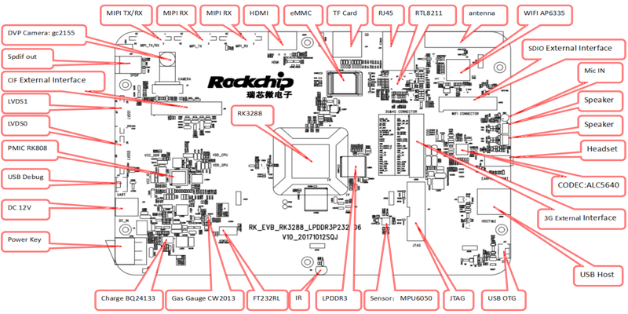

- RK3288 EVB 正面图：

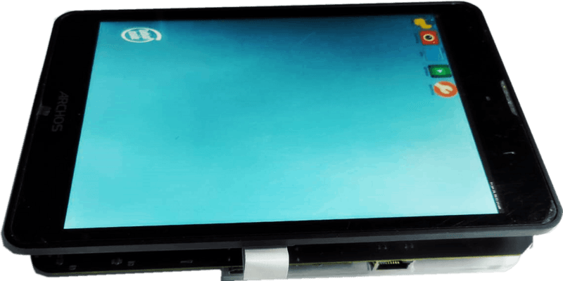

- RK3288 EVB 背面图：

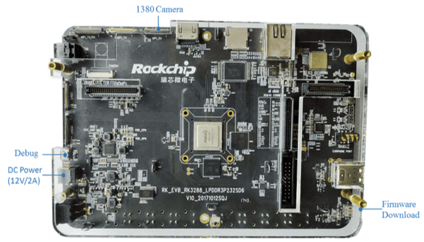

RK3326 EVB 接口分布图如下：

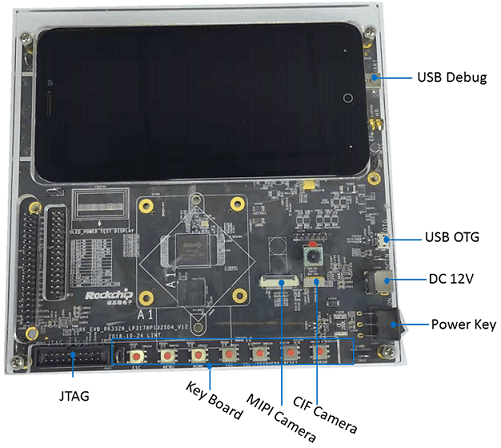

RK3399 挖掘机接口分布图如下：

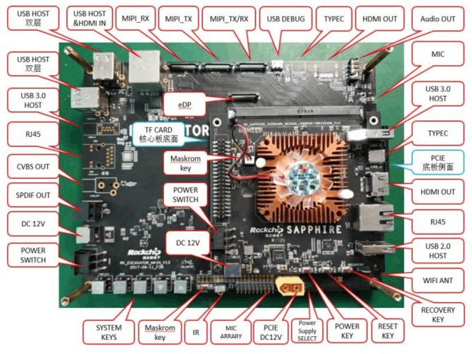

RK3399 IND 行业板接口分布图如下：

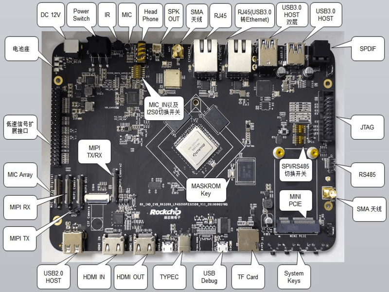

RK3566 EVB2 接口分布图如下：

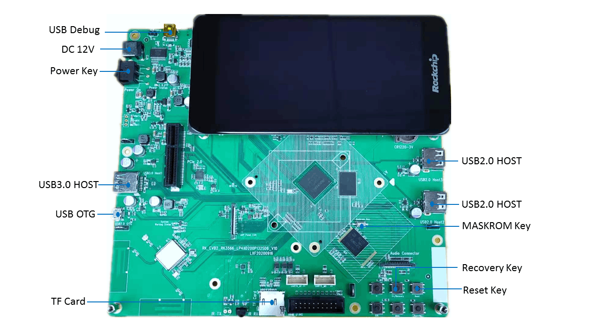

RK3568 EVB1 开发板接口分布图如下：

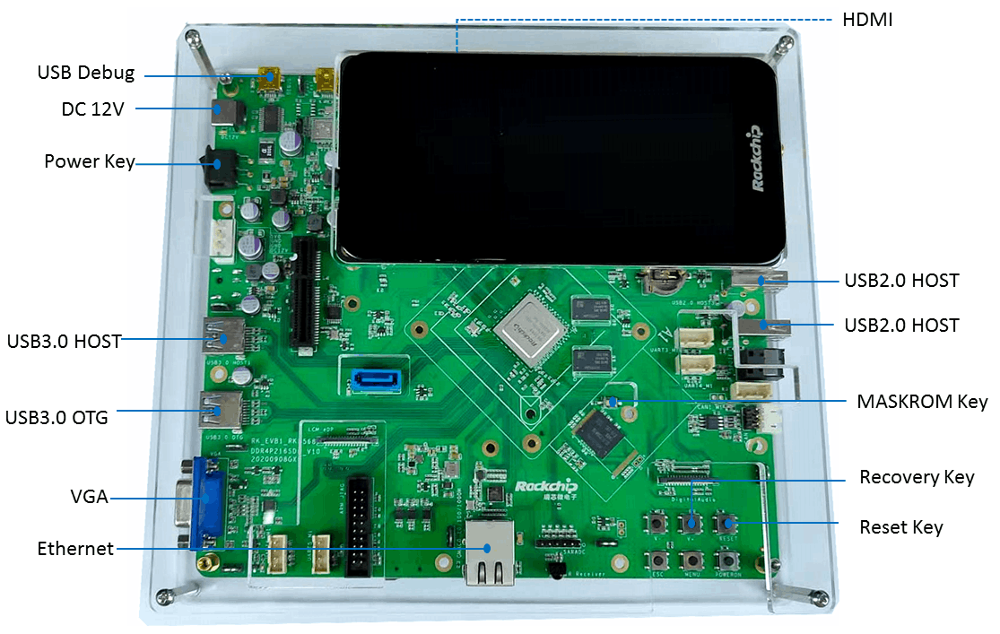

#### Windows 刷机说明

SDK 提供 Windows 烧写工具(工具版本需要 V2.84 或以上)，工具位于工程根目录：

```shell
RK3288_EVB-OHOS_L2-20210810/RKDevTool_Release
```

如下图，编译生成相应的固件后，设备烧写需要进入 MASKROM 或 BootROM 烧写模式，
连接好 USB 下载线后，按住按键“MASKROM”不放并按下复位键“RST”后松手，就能进入
MASKROM 模式，加载编译生成固件的相应路径后，点击“执行”进行烧写，也可以按 “recovery" 按键不放并按下复位键 “RST” 后松手进入 loader 模式进行烧写，下面是 MASKROM 模式的分区偏移及烧写文件。(注意： Windows PC 需要在管理员权限运行工具才可执行)

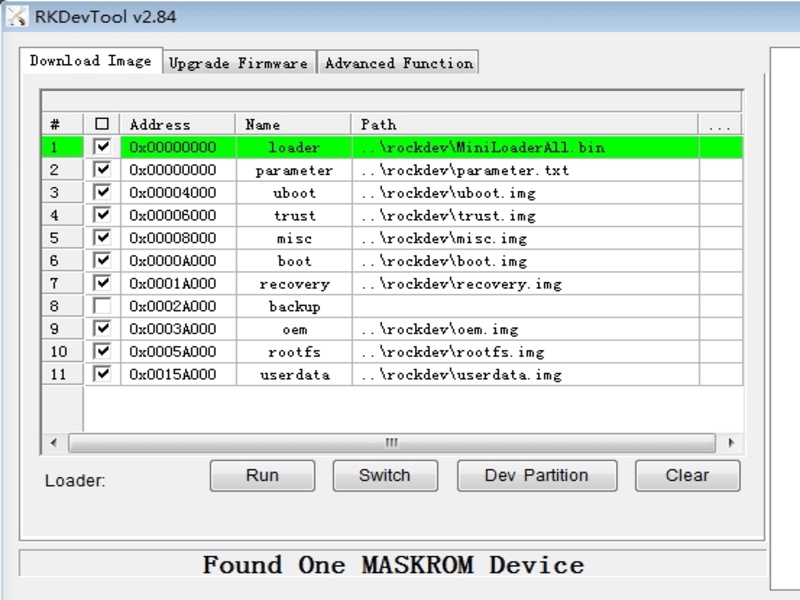</left>

注：烧写前，需安装最新 USB 驱动，驱动详见：

```shell
tools/DriverAssitant_v5.11.zip
```

#### Linux 刷机说明

Linux 下的烧写工具位于 tools 目录下(Linux_Upgrade_Tool 工具版本需要 V1.65 或以上)，请确认你的板子连接到 MASKROM/loader rockusb。比如编译生成的固件在 rockdev 目录下，升级命令如下：

```shell
sudo ./upgrade_tool ul rockdev/MiniLoaderAll.bin
sudo ./upgrade_tool di -p rockdev/parameter.txt
sudo ./upgrade_tool di -u rockdev/uboot.img
sudo ./upgrade_tool di -t rockdev/trust.img
sudo ./upgrade_tool di -misc rockdev/misc.img
sudo ./upgrade_tool di -b rockdev/boot.img
sudo ./upgrade_tool di -recovery rockdev/recovery.img
sudo ./upgrade_tool di -oem rockdev/oem.img
sudo ./upgrade_tool di -rootfs rocdev/rootfs.img
sudo ./upgrade_tool di -userdata rockdev/userdata.img
sudo ./upgrade_tool rd
```

或升级打包后的完整固件：

```shell
sudo ./upgrade_tool uf rockdev/update.img
```

或在根目录，机器在 MASKROM 状态运行如下升级：

```shell
./rkflash.sh
```

### 运行效果

</left>

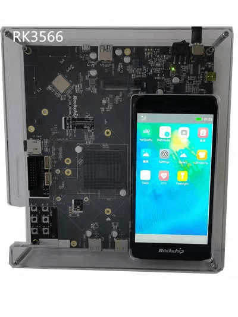</left>

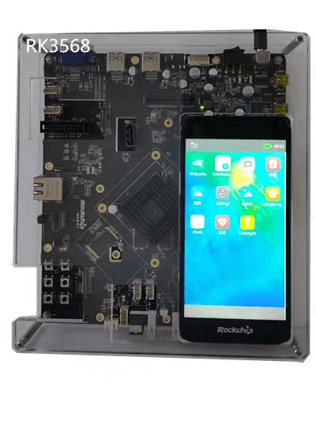</left>

## FAQ

目前发现存在的一些问题：

-  Launcher显示颜色反调， 需要要求内核format更改位DRM_FORMAT_XBGR8888((颜色反掉已修复)，

-  vsync问题，如上显示补丁vsync.patch，主要还是框架上的不兼容 (最新master已修复)

-  OS对UI或框架对显示宽需要16字节对齐，如果遇到宽不是16对齐的分辨率，就会遇到显示异常 （特别RK3566/RK3568 1080*1920就有这个问题，patches可workaround修复）

-  多屏支持还有问题，目前kernel关掉其他无用的屏幕才能正常显示

## TODO

1. 适配Rockchip的device目录，添加SOC内核构建的子系统 （已构建）

2. 使用OHOS自带的kernel，来适配Rockchip平台  （已构建）

3. HDF驱动的移植， LCD、触摸屏，WiFi等外设的适配  （正在开发）

4. Rockchip音视频多媒体，图形加速的适配 （正在开发）

5. Weston性能、功能优化的适配 （正在开发）

